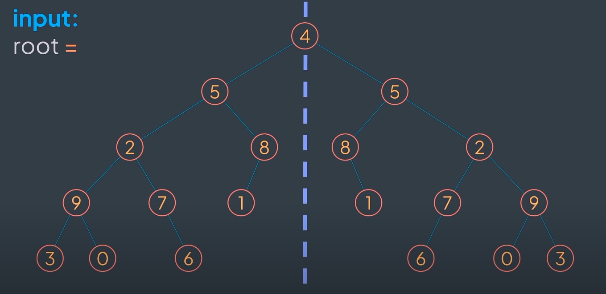
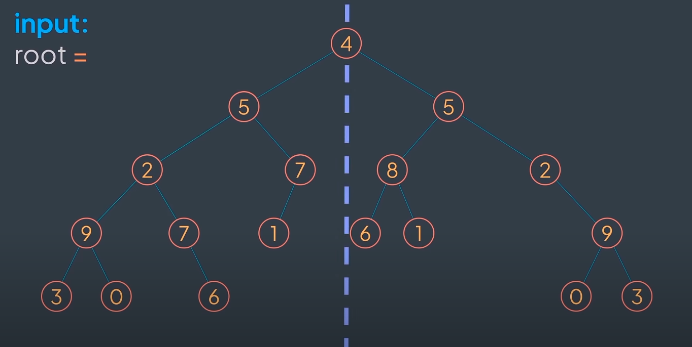

## Symmetric Tree

Given a binary tree root, check if it's symmetric around its center (a mirror of itself).

A symmetric tree, also known as a mirror tree, is a binary tree where the left subtree is a mirror reflection of the right subtree. 

Example:

Symmetric Tree



Un-symmetric Tree:



A solution using recursion:

```python
class TreeNode:
    """
    Class representing a node in a binary tree.

    Attributes:
        value (int): The value of the node.
        left (TreeNode): The left child of the node.
        right (TreeNode): The right child of the node.
    """

    def __init__(self, value):
        """
        Initializes a node with a value.

        Args:
           value (int): The value of the node.
        """
        self.value = value
        self.left = None
        self.right = None


def is_symmetric(root_node):
    """
    Checks if a binary tree is symmetric.

    A binary tree is symmetric if the left subtree is a mirror reflection of the right subtree.

    Args:
        root_node (TreeNode): The root of the binary tree.

    Returns:
        bool: True if the tree is symmetric, False otherwise.
    """
    if root_node is None:
        return True

    def is_mirror(left_node, right_node):
        """
        Checks if two binary trees are mirror images of each other.

        Args:
            left_node (TreeNode): The root of the first tree.
            right_node (TreeNode): The root of the second tree.

        Returns:
            bool: True if the trees are mirror images, False otherwise.
        """
        if left_node is None and right_node is None:
            return True
        if left_node is None or right_node is None:
            return False

        return (
                (left_node.value == right_node.value) and
                is_mirror(left_node.left, right_node.right) and
                is_mirror(left_node.right, right_node.left)
        )

    return is_mirror(root.left, root.right)


# Example usage
if __name__ == "__main__":
    # Root node
    root = TreeNode(4)

    # Creating left tree nodes
    root.left = TreeNode(5)

    root.left.left = TreeNode(2)
    root.left.left.left = TreeNode(9)

    root.left.left.left.left = TreeNode(3)
    root.left.left.left.right = TreeNode(0)

    root.left.left.right = TreeNode(7)
    root.left.left.right.right = TreeNode(6)

    root.left.right = TreeNode(8)
    root.left.right.left = TreeNode(1)

    # Creating right tree nodes
    root.right = TreeNode(5)
    root.right.left = TreeNode(8)
    root.right.left.right = TreeNode(1)

    root.right.right = TreeNode(2)
    root.right.right.left = TreeNode(7)
    root.right.right.left.left = TreeNode(6)

    root.right.right.right = TreeNode(9)
    root.right.right.right.left = TreeNode(0)
    root.right.right.right.right = TreeNode(3)

    assert (is_symmetric(root))
```