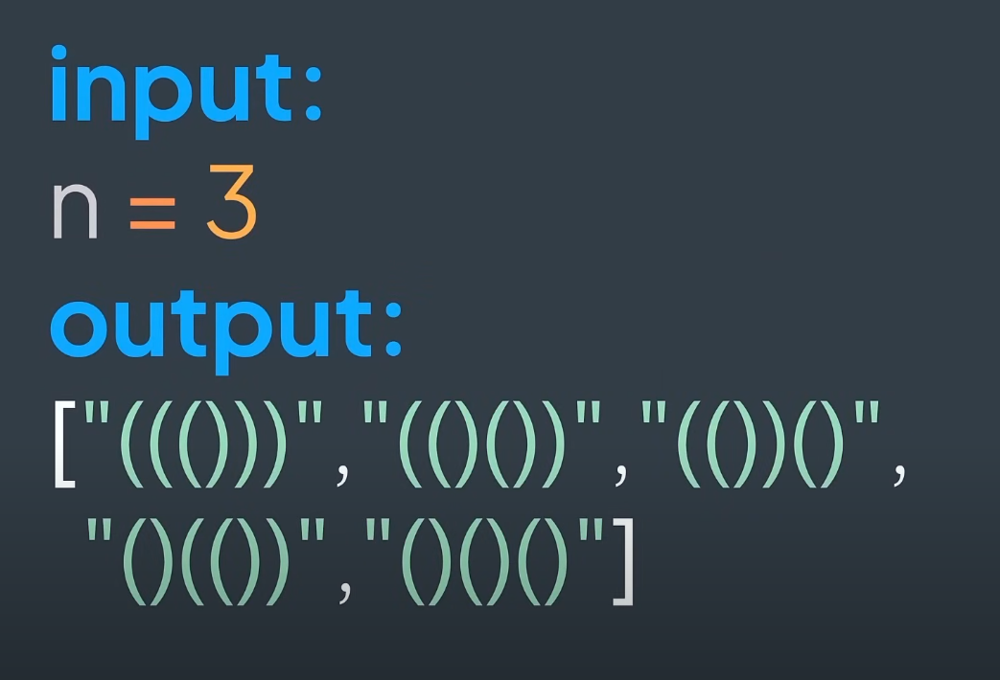

## Generate Parentheses (())()

Given an integer ``n``, generate all the valid combinations of ``n``
pairs of parentheses.

For example:



A combination that contains 1 type of parentheses is valid if every opening parenthesis has
its closing parenthesis, and it doesn't have a closing parenthesis without having an unused opening
parenthesis before it.

A solution using backtracking:

```python
def generate_parenthesis(n):
    """
    Generates all possible combinations of well-formed parentheses.

    Args:
        n (int): The number of pairs of parentheses.
    
    Returns:
        list: A list of strings, each representing a possible combination of well-formed parentheses.
    """

    def backtrack(open_count, close_count, current_combination):
        # If the current combination has the correct number of parentheses, add it to the results list.
        if len(current_combination) == 2 * n:
            result.append("".join(current_combination))
            return

        # If the number of open parentheses is less than n, add an open parenthesis to the current combination
        if open_count < n:
            current_combination.append("(")
            backtrack(open_count + 1, close_count, current_combination)
            current_combination.pop()

        # If the number of closed parentheses is less than the number of open parentheses, add a closed parenthesis to the current combination.
        if close_count < open_count:
            current_combination.append(")")
            backtrack(open_count, close_count + 1, current_combination)
            current_combination.pop()

    result = []
    backtrack(0, 0, [])
    return result
```

Calling the function:

```python
if __name__ == "__main__":
    n = 3
    result = generate_parenthesis(n)
    print(result)
```

The output:

```bash
['((()))', '(()())', '(())()', '()(())', '()()()']
```