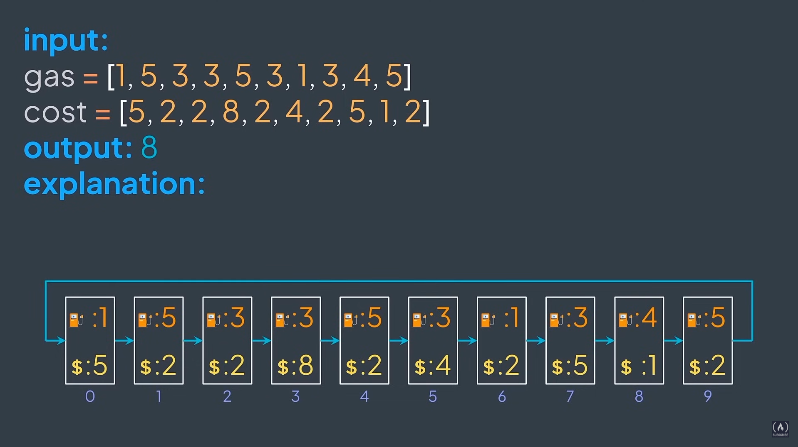
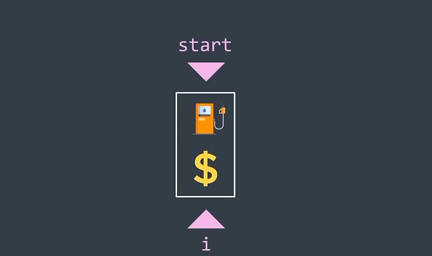
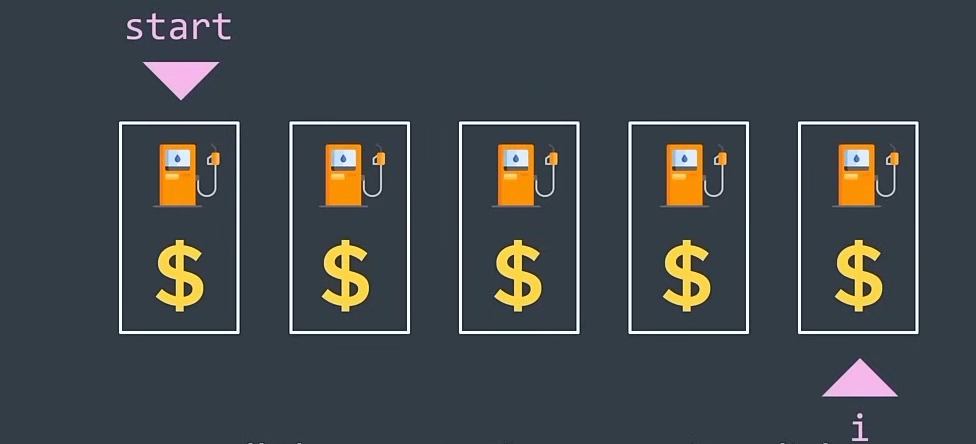

## Gas Station Problem

Given a circular list of gas stations, where we can go from station ``i`` to the station ``i + 1``, and the last one
goes back to the first one, find the index of the station from where we start to be able to traverse all the stations
and go back to the initial one without running out of gas.



Some constraints of the problem are:

```
|gas| == |cost|
gas[i] >= 0
cost[i] >= 0
```

- The length of the gas and cost lists is the same.
- The amount of gas at each station and the cost of gas to travel between stations are non-negative integers.
- Can only move forward
- The gas tank starts empty
- ``gas[i]`` represents the amount of gas at the station ``i``
- ``cost[i]`` represents the cost to go from the station ``i`` to the next one
- The answer is guaranteed to be unique
- If the station searching for doesn't exist, return -1

A brute force solution:

**For** each station ``i``:<br>
&nbsp;&nbsp;Start traversing from there<br>
&nbsp;&nbsp;**If** the car goes back to ``i``:<br>
&nbsp;&nbsp;&nbsp;&nbsp;``i`` is the right station, return it

A first solution can be implemented as:

```python
gas = [1, 5, 3, 3, 5, 3, 1, 3, 4, 5]
cost = [5, 2, 2, 8, 2, 4, 2, 5, 1, 2]

def can_traverse(gas, cost, start):
    """
    Checks if it's possible to traverse a circular route with given gas and cost.

    Args:
        gas (list): The amount of gas at each station.
        cost (list): The cost of gas to travel from each station to the next.
        start (int): The starting station.

    Returns:
        bool: True if it's possible to traverse the route, False otherwise.
    """
    # Get the number of stations
    n = len(gas)
    # Initialize the remaining gas
    remaining = 0
    # Initialize the current station
    i = start
    # Flag to track if we've started the journey
    started = False
    # Traverse the route
    while i != start or not started:
        started = True
        # Calculate the remaining gas after traveling from the current station to the next
        remaining += gas[i] - cost[i]
        # If the remaining gas is negative, it's not possible to traverse the route
        if remaining < 0:
            return False
        # Move to the next station
        i = (i + 1) % n
    # If we've traversed the entire route without running out of gas, return True
    return True


def gas_station(gas, cost):
    """
    Finds the starting gas station for a circular route.

    Args:
        gas (list): The amount of gas at each station.
        cost (list): The cost of gas to travel from each station to the next.

    Returns:
        int: The index of the starting station, or -1 if it's not possible.
    """
    # Iterate over each station as a potential starting point
    for i in range(len(gas)):
        # Check if it's possible to traverse the route starting from the current station
        if can_traverse(gas, cost, i):
            # Return the index of the starting station
            return i
    # If no starting station is found, return -1
    return -1
```

A more detailed explanation:

The ``can_traverse`` function checks if it's possible to traverse a circular route starting from a given station.
It iterates over the stations, keeping track of the remaining gas. If the remaining gas becomes negative at any given 
point, it returns False. If it successfully traverses the entire route without running out of gas, it returns True.

The ``gas_station`` function finds the starting gas station's  index by iterating over each station as a potential starting
point and calling the ``can_traverse`` function. If it finds a start station that allows traversing the entire route, 
it returns the index of that station. If no such station is found, it returns -1.

If a station ``start`` reaches a negative amount at the index ``i``, then all stations between ``start`` and ``i``
inclusive are invalid, so start again from ``i + 1``.

The case ``gas[start]`` $\lt$ ``cost[start]`` $\implies$ the car directly stops, no other stations are involved.



The other case when ``gas[start]`` $\ge$ ``cost[start]`` $\implies$ if the car reaches a negative amount of gas at the 
index ``i``, all stations between ``start`` and ``i`` inclusive are invalid.

