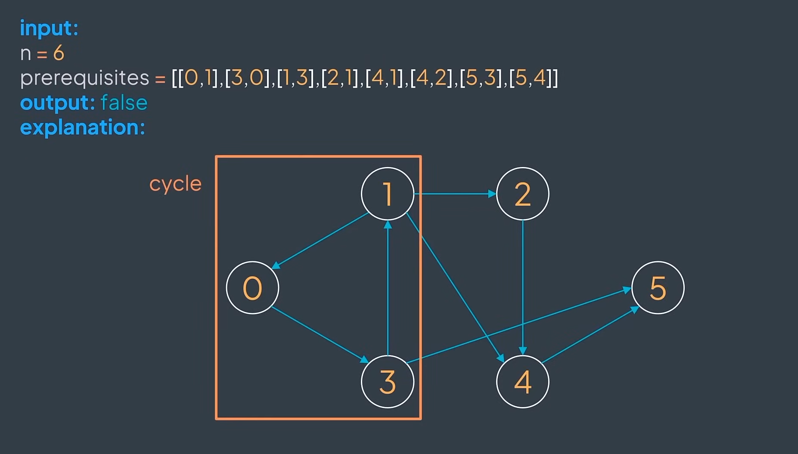
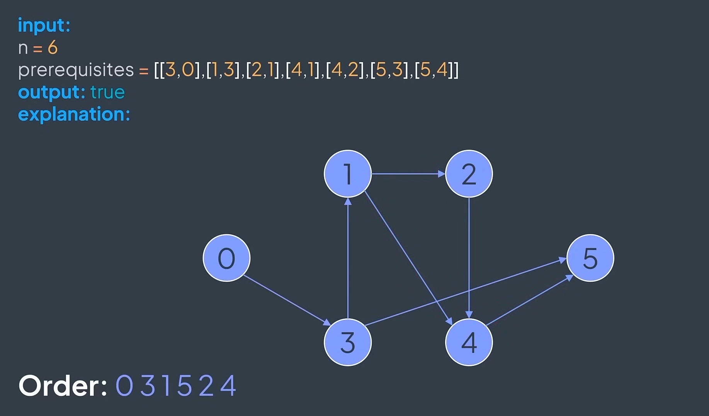

## Course Schedule

Given an integer ``n`` representing the number of courses (courses are labeled from 0 to $n - 1$), and an array $prerequisites$
where $prerequisites[i] = [a, b]$ means that you first need to take the course $b$ before taking the course $a$, determine if
it's possible to finish all courses.

An impossible course schedule:

A possible course schedule:

