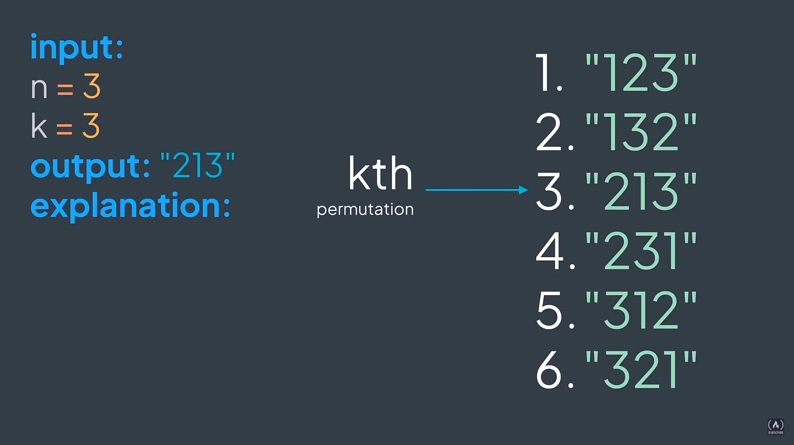

## Kth Permutation

With the range of numbers from 1 to n inclusive, we can make n! permutations.
By labeling them in order starting from 1, you are asked to return the kth permutation.


For example:



A first solution not efficient for large values of n, 
generating all permutations is impractical due to the factorial growth (n! permutations):

```python
import itertools


def kth_permutation(n, k):
    """
    Returns the k-th lexicographically ordered permutation of numbers from 1 to n.

    Args:
        n (int): The number of elements to permute (1 to n)
        k (int): The position of the permutation in lexicographic order (1-indexed)

    Returns:
        str: The k-th permutation as a string of concatenated digits.

    Raises:
        ValueError: If k is out of range (k < 1 or k > n!).

    Example:
        >>> kth_permutation(3, 2)
        '132'
    """
    permutations = list(itertools.permutations(range(1, n + 1)))

    if k < 1 or k > len(permutations):
        raise ValueError(f"k={k} out of range for n={n} (1 to {len(permutations)})")

    return ''.join(map(str, permutations[k - 1]))
```

A more efficient solution that handles larger ``n`` efficiently compared to generating all permutations, and 
computes k-th permutation without enumerating all:

```python
def kth_permutation(n, k):
    """
    Returns the k-th lexicographically ordered permutation of numbers from 1 to n.

    Args:
        n (int): The number of elements to permute (1 to n)
        k (int): The position of the permutation in lexicographically order (1-indexed)

    Returns:
        str: The k-th permutation as a string of concatenated digits.

    Raises:
        ValueError: If k is out of range (k < 1 or k > n!).
    """
    if k < 1 or k > math.factorial(n):
        raise ValueError(f"k={k} out of range for n={n} (1 to {math.factorial(n)})")

    nums = list(range(1, n + 1))
    result = []

    k -= 1  # Adjust k to 0-indexed

    for i in range(n, 0, -1):
        fact = math.factorial(i - 1)
        index = k // fact
        k %= fact
        result.append(nums[index])
        nums.pop()

    return ''.join(map(str, result))
```

The operation ``index = k // fact`` is a crucial part of the algorithm that efficiently computes the k-th permutation
without needing to generate all possible permutations, which is especially important for large values of ``n``.

#### Reasons for efficiency

1. **Avoids generating all permutations:** The number of permutations of ``n`` elements in ``n!`` (factorial), which grows extremely rapidly. For ``n=20``, ``n!`` is a huge number ( $\gt$ 2 $\times$ 10<sup>18</sup>)