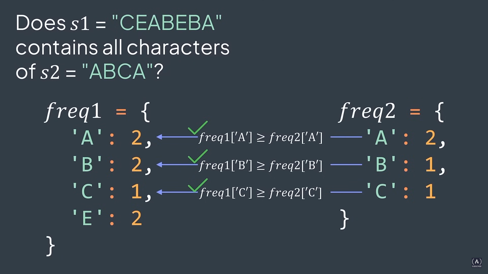

## Minimum window substring

Given two strings ``s`` and ``t``, find the shortest substring of ``s`` that contains all characters of ``t``.


#### Example use cases

1. **Text Search**: Can be used in text substring search applications to find the smallest substring of a document tha contains all the search terms.
2. **Data Compression**: Can be used in data compression applications to find the smallest substring of a string that contains all the required characters.

For example, with the input:

**s** = "ADCFEBECEABEBADFCDFCBFCBEAD"

**t** = "ABCA"

And the output:

**output**: "CEABEBA"

#### Explanation:

"ADCFEBE<u>CEABEBA</u>DFCDFCBFCBEAD"

**CEABEBA** is the shortest substring of ``s`` that contains all characters of ``t`` (2 'A's, 1 'B', 1 'C')



An implementation of solution not optimized:

```python
from collections import Counter

def contains_all(freq1, freq2):
    """
    Checks if the frequency of characters in `freq1` is sufficient to cover `freq2`.
    
    Args:
    freq1 (dict): Dictionary with the frequency of characters in the first string.
    freq2 (dict): Dictionary with the frequency of characters in the second string.
    
    Returns:
    bool: True if `freq1` has sufficient frequency to cover `freq2`, False otherwise.
    """
    for ch in freq2:
        if freq1[ch] < freq2[ch]:
            return False
    return True

def min_window(s, t):
    """
    Find the smallest window (substring) in `s` that contains all the characters of `t`.

    Args:
    s (str): String where the window will be searched.
    t (str): String containing the characters the window should contain.

    Returns:
    str: The smallest window in `s` that contains all the characters of `t`. If there is no such window, it returns an empty string.
    """
    n, m = len(s), len(t)

    if m > n or m == 0:
        return ""

    freq_t = Counter(t)

    shortest = " " * (n + 1)

    for length in range(1, n + 1):
        for i in range(n - length + 1):
            sub = s[i:i + length]
            freq_s = Counter(sub)
            if contains_all(freq_s, freq_t) and length < len(shortest):
                shortest = sub

    return shortest if len(shortest) <= n else ""
```

### Complexity 

- Time: The time complexity is O(n^3) due to nested loops and the creation of a ``Counter`` for each substring.

_Improvements_: The ``min_window`` function can be optimized using a sliding window approach, which would reduce the time complexity to O(n).